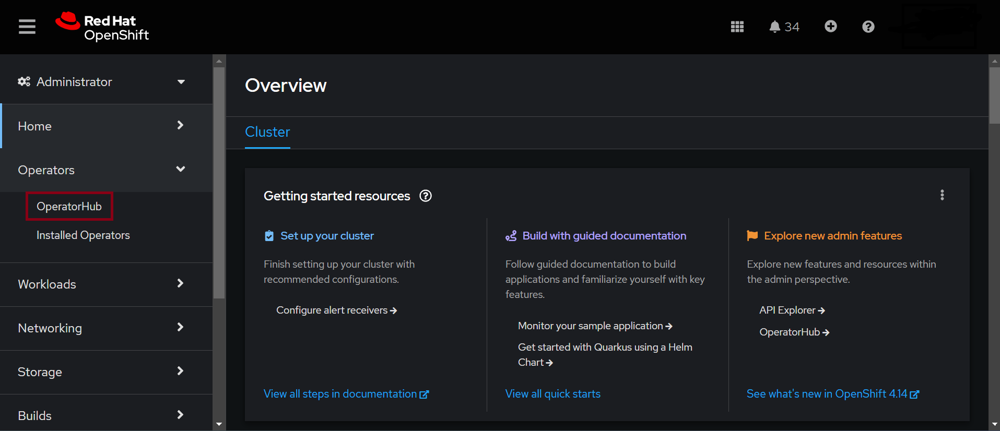
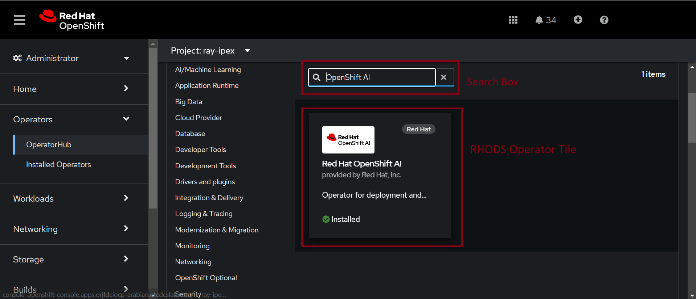
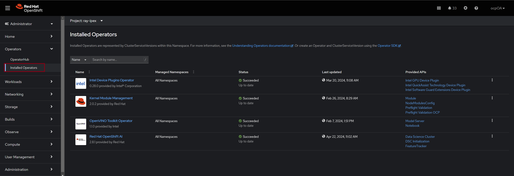
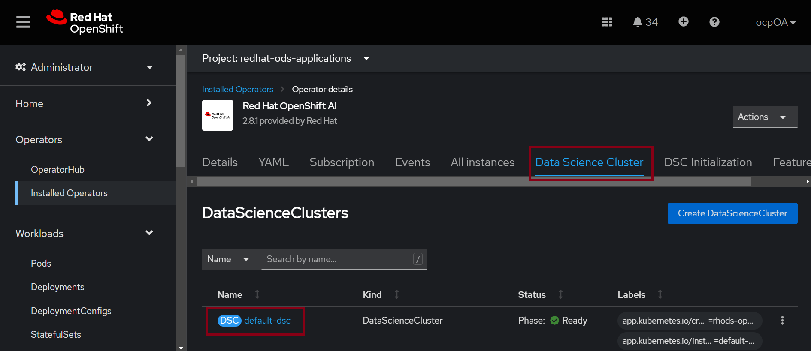

# Intel® Extension for PyTorch with KubeRay on RedHat® OpenShift

In this demo notebook we demonstrate how you can utilize the Intel® Extension for PyTorch to run distributed pytorch workloads on RedHat® OpenShift. The notebook uses the [CodeFlare SDK](https://github.com/project-codeflare/codeflare-sdk) to connect to the [KubeRay](https://docs.ray.io/en/latest/cluster/kubernetes/index.html) operator and CodeFlare operator to launch distributed jobs. Before we start running the notebook we need to setup the environment correctly to run it successfully. More details can be found in the section below.

## Setup
Before we start running the notebook we need to make sure a few things are in place that are described in this section.

* Install the [OpenShift AI](https://www.redhat.com/en/technologies/cloud-computing/openshift/openshift-ai) operator. Follow the steps below to install the OpenShift AI operator correctly. If you already have OpenShift AI operator installed you can skip to Step 2.

    - Open the OpenShift Web Console and click on the Operator->OperatorHub tab on the left panel. Refer to the screenshot below.
        
    - Now in the search box type "OpenShift AI" and that'll show you the "RedHat OpenShift AI" tile for the operator. Refer to the screenshot below.
        
    - Click on the tile and click on the Install button. This will install all the necessary resources and the operator.

* Enable CodeFlare and KubeRay for OpenShift AI.

    - Open the OpenShift Web Console and click on the Operator->Installed Operators tab on the left panel. Refer to the screenshot below.
        
    - Click on the "RedHat OpenShift AI" operator and go to the tab named "Data Science Cluster"(DSC). Refer to the screenshot below.
        
    - Click on `default-dsc` from the DSC page (refer to above image), which will take you the resource page. Now click on the "YAML" tab to edit the definition of the resource.

    - Scroll down to `spec.components.codeflare` and edit the value for the key `managementState` to `Managed`. Do the same for `spec.components.ray`. Now save the YAML and wait for the KubeRay and CodeFlare operators to be initialized. You should be able to see pods for codeflare and kuberay running in the `redhat-ods-applications` project.

* Build and push the Ray-IPEX image by running the following commands. Please login to your OCP cluster before running these commands.

    ```bash
    export LOCAL_REGISTRY=$(oc get route default-route -n openshift-image-registry --template='{{ .spec.host }}')
    git clone https://github.com/IntelAI/oneAPI-samples
    cd oneAPI-samples/intel-extension-for-pytorch/Distributed/
    docker build -t $LOCAL_REGISTRY/ray-ipex/ray-ipex:latest --build-arg BASE_IMAGE=quay.io/opendatahub/workbench-images:jupyter-intel-pytorch-ubi9-python-3.9-20240422 .
    oc new-project ray-ipex
    docker push $LOCAL_REGISTRY/ray-ipex/ray-ipex:latest
    ```

* Collect necessary information to login to the cluster from the notebook by using the following commands.
  Note down the value of the token and API server URL.
    
    - Find the Token for authentication.

        ```bash
        oc whoami --show-token
        ```
    
    - Find the URL of API Server.
    
        ```bash
        oc cluster-info
        ```

* Install and enable Intel AI Tools for OpenShift by following the [instructions](https://github.com/intel/ai-containers/blob/main/enterprise/redhat/openshift-ai/README.md#intel-oneapi-ai-tools-containers-on-openshift-ai). Also, start the Intel® Optimized PyTorch jupyter notebook from the same instructions. 

* When you start the notebook it will clone the oneAPI samples into your working directory. Now open the notebook located at `oneAPI-samples/intel-extension-for-pytorch/Distributed/KubeRay_Getting_Started.ipynb` and edit in the required variables  marked by `XXXX` from above commands.

* Now you can run the notebook.

## Next Steps
This demo introduces how Intel® Extension for PyTorch can be used together with KubeRay and CodeFlare to launch distributed jobs on RedHat OpenShift cluster. You can modify the notebook and the python script to to launch your own AI workload as the next steps.

## Troubleshooting and Support

If you need more help feel free to submit an [issue](https://github.com/intel/ai-containers/issues).

---
\* Other names and brands may be claimed as the property of others. Trademarks
